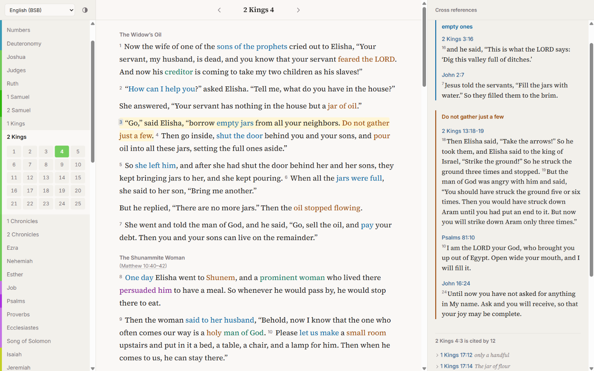

# Cross-reference Reader

A Bible reader built on the [CrossReferences.org](https://github.com/CrossReferences-org/bible-cross-references)
dataset: phrase-level cross-references from the Treasury of Scripture Knowledge, anchored
in each translation's own words. Select a highlighted word to see what it points to, or a
verse number to see everything on that verse.




## How to run

You'll need the [.NET 10 SDK](https://dotnet.microsoft.com/download). Use this template (or clone it), then:

```sh
dotnet run --project Reader
```

and open `http://localhost:5080`. The data ships with the repo, so there's nothing to wire up.

If you host your own copy, please give it your own name (`Reader/wwwroot/manifest.webmanifest`).
It needs about 500 MB of memory.

## How it works

.NET 10, Blazor with static server rendering. No database, no interactive circuits.

At startup the app reads the JSON in `Reader/json/` and builds everything it serves: each
translation's verses (split records joined in that translation's order), where every anchor
sits in its verse, and the verse HTML itself. The log reports how many anchors were placed,
and how many could not be, per translation.

Pages are rendered on the server. The reference pane is filled with small HTML fragments
from `/pane/...`, fetched by `wwwroot/js/reader.js` when a word or verse number is selected.
The browser only ever holds what is on screen.

### Placing anchors

Each anchor is searched for only inside its own verse record, case-sensitively first and
then case-insensitively.

- **KJV** follows the TSK's own rule: each anchor is the next occurrence after the previous one.
- **Other translations**: anchors that occur once are placed first. An anchor occurring more
  than once takes its first occurrence not already covered by another anchor.

Anchors are not meant to overlap, but some do. The text is cut at every anchor boundary, and
a piece of text covered by several anchors opens all of them, innermost first. It is marked
with a double underline.

## Configuration

`Reader/appsettings.json`:

| Setting | Meaning |
| --- | --- |
| `Reader:DefaultTranslation` | Where a first-time visitor lands. `BSB` by default. |
| `Reader:PathBase` | Set when hosting under a sub-path behind a proxy, e.g. `/reader`. |

The S21 translation is enabled by an optional file; see `Reader/json/optional/README.md`.

## Data

`Reader/json/` is a copy of the dataset's `json/` folder. Corrections belong in the
[data repository](https://github.com/CrossReferences-org/bible-cross-references), not here.
Cross-reference data © CrossReferences.org, licensed [CC BY 4.0](https://creativecommons.org/licenses/by/4.0/).
Bible texts: KJV, BSB and AOV, all public domain.

Fonts: Source Serif 4 and Inter, SIL Open Font License (see `Reader/wwwroot/fonts/`).
